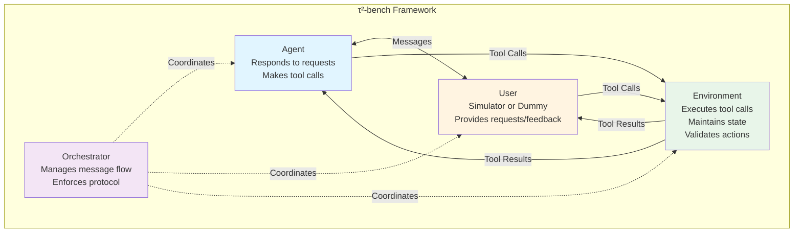
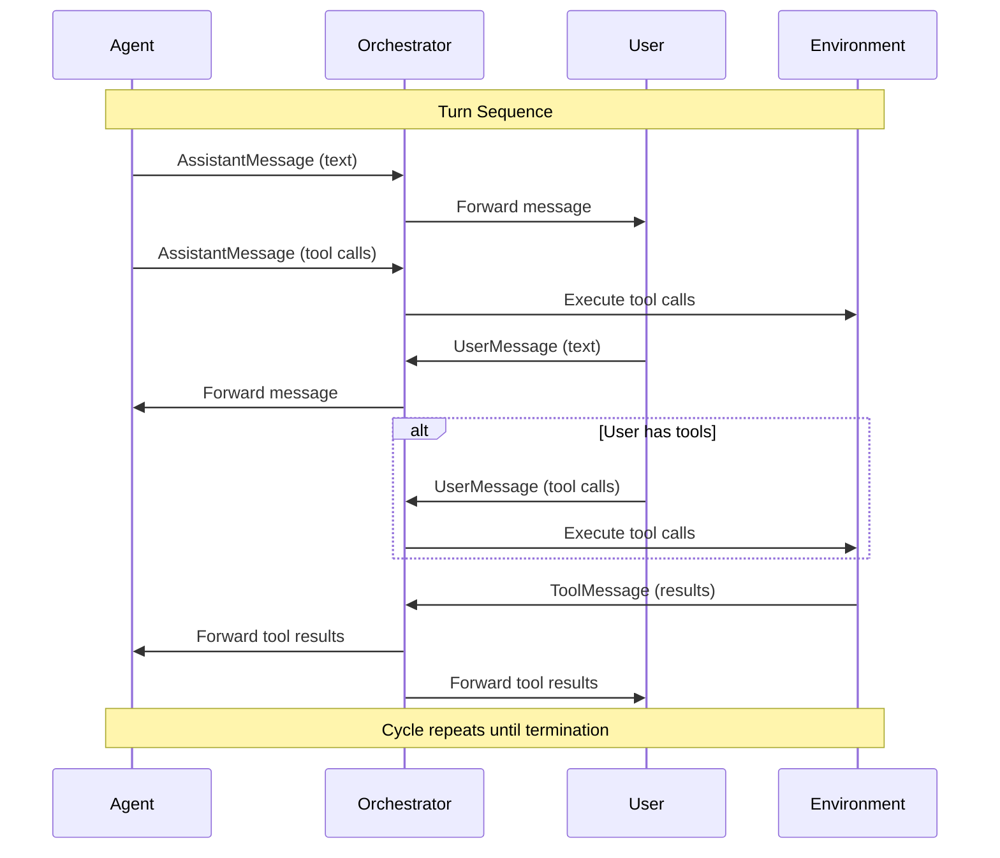
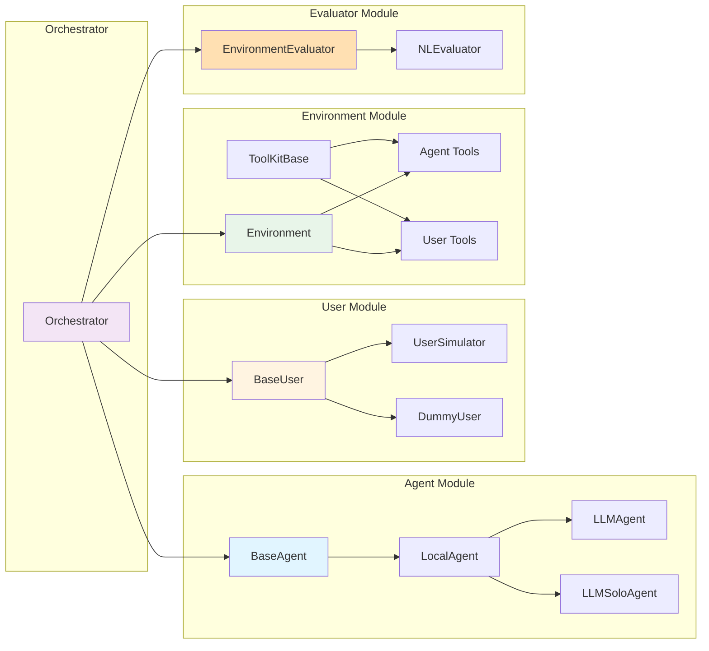
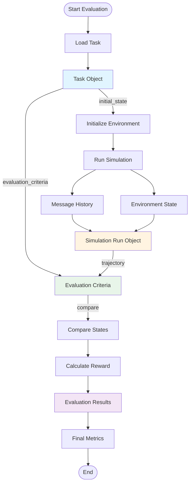
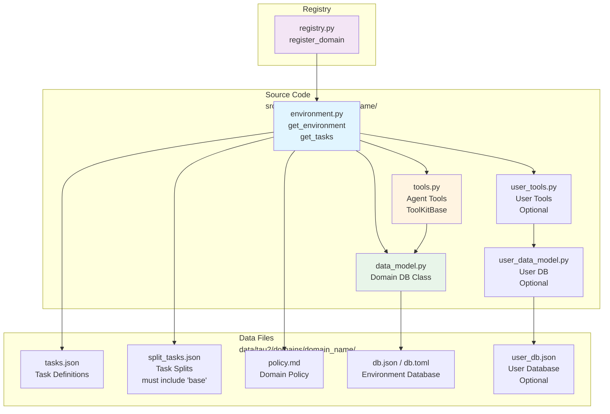
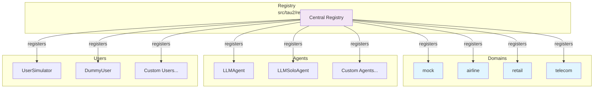

# WARP.md

This file provides guidance to WARP (warp.dev) when working with code in this repository.

## Project Overview

τ²-bench (tau2-bench) is a benchmark framework for evaluating conversational agents in dual-control environments. It simulates customer service scenarios where both the agent and user can interact with the environment using tools.

### Core Concepts

**Three-Role Architecture**: The framework orchestrates interactions between three entities:

- **Agent**: Responds to user requests and makes tool calls to solve tasks
- **User**: Either a simulator (LLM-based) or dummy user, provides requests and feedback
- **Environment**: Executes tool calls, maintains state, and validates actions

**Domains**: Self-contained evaluation scenarios with policies, tools, tasks, and databases:

- `mock`: Simple testing domain
- `airline`: Flight booking and management
- `retail`: E-commerce operations
- `telecom`: Telecommunications customer service

**Modes**:

- **Normal Mode**: Agent converses with a user simulator
- **Solo Mode**: Agent works independently on tickets without user interaction (agent can only make tool calls)

### Three-Role Architecture Diagram



## Development Commands

### Installation & Setup

```bash
# Install in editable mode (recommended for development)
pip install -e .

# Verify data directory setup
tau2 check-data

# Setup API keys: copy .env.example to .env and configure
```

### Testing

```bash
# Run all tests
make test

# Run domain-specific tests
pytest tests/test_domains/<domain_name>

# Run specific test files
pytest tests/test_agent.py
pytest tests/test_environment.py
pytest tests/test_orchestrator.py
```

### Code Quality

```bash
# Check linting
make lint

# Format code (uses ruff)
make format

# Auto-fix linting issues
make lint-fix

# Run both linting and formatting
make check-all
```

### Running Evaluations

```bash
# Quick test evaluation (5 tasks, 1 trial each)
tau2 run --domain airline --agent-llm gpt-4.1 --user-llm gpt-4.1 --num-trials 1 --num-tasks 5

# Full evaluation on base task split (for benchmarking)
tau2 run --domain airline --agent-llm gpt-4.1 --user-llm gpt-4.1 --num-trials 4 --task-split base

# Solo mode (agent only, no user interaction)
tau2 run --domain telecom --agent llm_agent_solo --agent-llm gpt-4.1 --user dummy_user

# Oracle plan mode (agent given ground-truth plan)
tau2 run --domain telecom --agent llm_agent_gt --agent-llm gpt-4.1 --user-llm gpt-4.1
```

### Interactive Tools

```bash
# Play mode - manually control agent or user
tau2 play

# View simulation results
tau2 view

# View domain documentation (starts server on port 8004)
tau2 domain <domain_name>
# Then visit http://127.0.0.1:8004/redoc

# Environment CLI (interactive testing)
make env-cli
```

### Leaderboard Submission

```bash
# Prepare submission package
tau2 submit prepare data/tau2/simulations/my_model_*.json --output ./my_submission

# Validate submission
tau2 submit validate ./my_submission

# Verify individual trajectories
tau2 submit verify-trajs data/tau2/simulations/my_model_*.json
```

### Cleanup

```bash
make clean  # Remove generated files and virtual environment
```

## Architecture

### Message Flow Protocol

**Message Types**:

- `AssistantMessage`: Agent responses (text or tool calls)
- `UserMessage`: User messages (text or tool calls in domains with user tools)
- `ToolMessage`: Environment responses to tool calls
- `MultiToolMessage`: Wraps multiple tool responses

**Communication Rules**:

1. Messages contain EITHER text OR tool calls, never both
2. Messages cannot be empty
3. Tool calls must be followed by corresponding tool responses from environment

**Turn Sequence**:

```
Agent → User (text response)
Agent → Environment (tool call)
User → Agent (text message)
User → Environment (tool call, if user tools exist)
Environment → Agent (tool result)
Environment → User (tool result)
```

### Message Flow Diagram



### Core Components



**Orchestrator** (`src/tau2/orchestrator/orchestrator.py`):

- Manages message flow between Agent, User, and Environment
- Enforces communication protocol
- Handles initialization, termination, error tracking
- Validates message history and state transitions

**Agent** (`src/tau2/agent/`):

- `BaseAgent`: Abstract interface all agents must implement
- `LocalAgent`: Base class for custom agent implementations
- `LLMAgent`: Default LLM-based agent
- `LLMSoloAgent`: Agent for solo mode (tool calls only)
- Key methods: `generate_next_message()`, `get_init_state()`, `stop()`

**User** (`src/tau2/user/`):

- `BaseUser`: Abstract user interface
- `UserSimulator`: LLM-based user simulator
- `DummyUser`: No-op user for solo mode
- `UserState`: Tracks conversation state with flipped roles (user as assistant)

**Environment** (`src/tau2/environment/environment.py`):

- Manages domain policy, tools, and state
- `ToolKitBase`: Base class for tool collections
- Separate tool sets for agent and user
- Syncs state between agent/user tools
- Validates actions against task evaluation criteria

**Evaluator** (`src/tau2/evaluator/`):

- `EnvironmentEvaluator`: Compares final environment state against gold standard
- `NLEvaluator`: Uses LLM to evaluate conversation quality
- Reward calculation based on DB state matching and environment assertions

### Data Flow



**Task Structure** (`src/tau2/data_model/tasks.py`):

```python
Task:
  - initial_state: InitializationData, actions, message_history
  - evaluation_criteria: Expected actions, environment assertions, reward basis
  - task_id, domain, split
```

**Simulation Run** (`src/tau2/data_model/simulation.py`):

- Complete trajectory with messages, rewards, termination reason
- Agent/user metadata, LLM configurations
- Evaluation results and metrics

### Domain Structure



Each domain in `src/tau2/domains/<domain_name>/`:

- `environment.py`: `get_environment()`, `get_tasks()` functions
- `data_model.py`: Domain-specific DB class
- `tools.py`: Agent tools (ToolKitBase implementation)
- `user_tools.py`: User tools (optional)
- `user_data_model.py`: User DB (optional)

Domain data in `data/tau2/domains/<domain_name>/`:

- `tasks.json`: Task definitions
- `split_tasks.json`: Task splits (must include 'base' split)
- `policy.md`: Domain policy
- `db.json` or `db.toml`: Environment database
- `user_db.json`: User database (optional)

### Registry System



`src/tau2/registry.py`:

- Central registration for domains, agents, users
- `registry.register_domain(get_environment_func, "domain_name")`
- `registry.register_agent(AgentClass, "agent_name")`
- Auto-discovery of registered components

## Key Implementation Details

### LLM Integration

- Uses LiteLLM for multi-provider support
- API keys configured via `.env` file
- Optional Redis caching (disabled by default, configure in `config.py`)
- Optional Langfuse tracing (disabled by default)

### Task Splits

- All domains have train/test splits
- **IMPORTANT**: Use `--task-split base` for benchmark evaluations to ensure consistency with original τ²-bench
- Default is `base` if not specified

### Configuration

`src/tau2/config.py` contains defaults for:

- Max steps (200), max errors (10)
- LLM models and temperatures
- Redis cache settings
- API port (8000)

### Testing Infrastructure

- `tests/test_domains/`: Domain-specific tool tests
- `tests/test_agent.py`, `test_environment.py`, `test_orchestrator.py`: Core component tests
- `tests/conftest.py`: Shared fixtures

### Gymnasium Interface

`src/tau2/gym/`:

- `AgentGymEnv`: Control agent against user simulator
- `UserGymEnv`: Control user against agent
- Standard gym interface: `reset()`, `step()`, `render()`
- Configure via `solo_mode`, `user_llm`, `agent_llm` parameters

## Development Guidelines

### Adding a New Domain

1. Create domain folder in `src/tau2/domains/<domain_name>/`
2. Implement required files: `environment.py`, `data_model.py`, `tools.py`
3. Create data files in `data/tau2/domains/<domain_name>/`
4. Register domain in `src/tau2/registry.py`
5. Add tests in `tests/test_domains/<domain_name>/`

### Creating a Custom Agent

1. Subclass `LocalAgent` in `src/tau2/agent/base.py`
2. Implement `generate_next_message()` and `get_init_state()`
3. Register in `src/tau2/registry.py`
4. Test with: `tau2 run --agent my_agent --domain <domain> ...`

### Message Validation

- Agent messages must use `validate_message_format()`
- Solo mode has stricter validation (tool calls only, except stop signal)
- Use `is_valid_agent_history_message()` and `is_valid_user_history_message()` for filtering

### Environment State Management

- Call `sync_tools()` after state changes
- Use `set_state()` to initialize or replay from message history
- Implement `get_db_hash()` for environment comparison

### Error Handling

- `AgentError`: Raised for agent-related errors
- `UserError`: Raised for user-related errors
- Orchestrator tracks error count and terminates at max_errors threshold

## Repository Structure Notes

- **Experimental Code**: `src/experiments/` contains research features (self-contained, not core framework)
- **Scripts**: `src/tau2/scripts/` contains CLI command implementations
- **Data Directory**: Set `TAU2_DATA_DIR` environment variable if not using editable install
- **Versioning**: Uses PDM for package management, version in `pyproject.toml`
